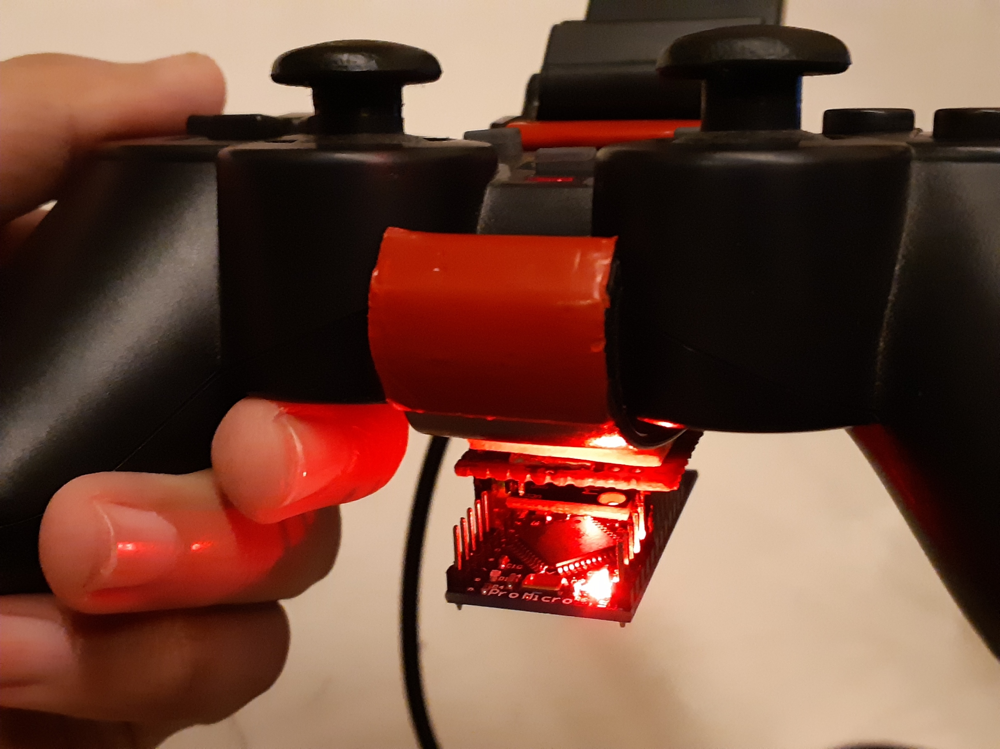

# Cemu Gyro Joystick

Using Arduino & IMU module, you can turn your generic joystick to have gyro & accelerometer sensors capability to be used on CEMU (WiiU Emulator).

It's a modified version from [cemu-no-gyro](https://github.com/quinton-ashley/cemu-no-gyro/) to accept raw custom joystick (virtual) input, as a way to pass gyro and accelerometer data from Arduino. The Arduino program is available [in this repository](https://github.com/ArsenicBismuth/Arduino-Programs/tree/master/Gyro_Joystick).

The end result is a very responsive device, at a similar level to a controller with native gyro & accelerometer supports. It's basically one step better than other solutions, which are using your smartphone as a source of sensors data, as they're very bulky.

## Changes:

-   Add capability to control the accelerometer.
-   3 axes for gyro and 3 axes for accelerometer.
-   Removing all preprocessing (except linear scaling).
-   Custom [Contro module](https://github.com/shroudedcode/contro) to accept 6-axis joystick instead of 4.
-   Also removing the requirement which only accept standard joystick.

## Instruction:

It's a rough instruction, since the program itself isn't really polished at the moment.

1.  Need (total ~$5 without the joystick):
	- Arduino board with 32u4 chip (the one used here is Pro Micro, or Leonardo).
	- Sensor module: MPU6050 (you can use anything else, but there'll be some more changes you have to do).
2.  **Connect MPU6050 to the Arduino. Upload the Arduino code to the Board.**
3.  Check [Windows gamepad settings](https://www.howtogeek.com/241421/how-to-calibrate-your-gaming-controller-in-windows-10/) to see if you have a virtual Joystick that has 6 axes. All controlled by the data from the sensor: accel (x,y,z) and gyro (x,y,z).
4.  **Open Settings > Calibrate. Make sure everything is maxed out at ±32767, and centered at 0.**
5. **Build the Cemu-GyroStick windows program using npm.**
6.  Run the Cemu-GyroStick program, wait until it's recognized. Then plug in your joystick (do it after the Arduino is recognized, otherwise your joystick would take it).
7.  Test using PadTest (available  [in the Cemuhook website](https://cemuhook.sshnuke.net/padudpserver.html)).
8.  Troubleshooting based on the PadTest behavior:
	- *Moving correctly*: successful.
	- *Moving incorrectly*: might need to invert something, or swap axes.
	- *Drifting*: you need to change the offset in the Arduino code.
	- *No response*: intuitively repeat some your steps differently.
10.  The rest is similar to how you'd add motion source to CEMU. 

It's lengthy, but most of it are basic steps (the main steps are in  **bold**). After you got everything working, it's only 2 steps affair:

1.  Run Cemu-GyroStick.
2.  Plug Arduino, then plug Joystick.

## Extras
Some discussions regarding this project, you may find answers to your questions there.

- [CEMU subreddit](https://www.reddit.com/r/cemu/comments/glf1t4).
- [Gaming subreddit](https://www.reddit.com/r/gaming/comments/gm1ogb/).
- [Wiring](docs/pinout.png).

## Credits
- Cemu no Gyro by [Quinton Ashley](https://github.com/quinton-ashley/).
- Cemuhook by [rajkosto](https://cemuhook.sshnuke.net/).
